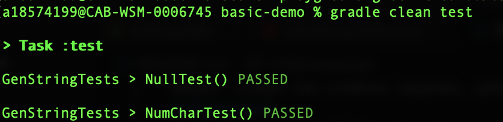

Проект создан как учебное задание, целью которого является сборка Java-проекта с использованием Gradle.
# Задание
Программа, которая выводит "Hello, " + случаный  String. Для генерация строки создать отдельный метод,
протестировать с помощью junit.

# Создание проекта

Изучив [мануал](https://guides.gradle.org/creating-new-gradle-builds/) и
[учебные материалы](https://spring-projects.ru/guides/gradle/), создана простая Gradle-сборка приложения с помощью

	> gradle init

# Конфигурация
В директории  в корне проекта /src/main/java/hello/ создан основной класс Hello.java и вспомогательный класс для генерации строки GenString.java.
Основной класс вызывает метод вспомогательного класса чтобы вывести фразу:

	System.out.println("Hello, " + greeter.getRandomString());

Суть вспомогателього метода заключается в подборе случайного набора (1..100) алфавитных символов из символьного массива:
	char[] chars = "abcdefghijklmnopqrstuvwxyz".toCharArray();
	
Количество символов считывается из stdin:

   
   
 Если введенное число не удовлетворяет заданным условиям, программа пишет предупреждение и
 по-умолчанию возвращает в качестве строки "world":
 
 

Чтобы проект запустился, в build.gradle необходимо прописать:

	apply plugin: 'java'
	apply plugin: 'application'

	mainClassName = 'hello.Hello' //означает, что основной класс находится по пути ./src/main/java/hello

При необходимости использовать библиотеки подключается  mavenCentral() - репозиторий библиотек с открытым исходным кодом для Java-проектов.

	repositories {
		mavenCentral()
	}

зависимости однозначно указываются:

	dependencies {
		implementation "группа:библиотека:версия библиотеки"
	}

Чтобы собрать проект в консоли пишется:

	gradle build

Чтобы запустить проект и, собственно увидеть строку "Hello, ...", нужен флаг run

	gradle run

# Тесты

Метод GenString протестирован с помощью библиотеки модульного тестирования JUnit 5
 Следуя [руководству](https://junit.org/junit5/docs/current/user-guide/) и
 [мануалу](https://junit.org/junit5/docs/current/user-guide/#writing-tests) написаны тесты для проверки существования строки:
> void NullTest()

    assertNotNull(str);

и проверки числа символов в сгенерированной строке для 5-ти случайных валидных чисел:

    @RepeatedTest(5)
        void PositiveNumCharTest() {code}
        
и чисел, не принадлежащих интервалу [1,100):

    @ParameterizedTest
    @ValueSource(ints = {0, -3, 495, -123, 101})
        void NotValidNumCharTest(int lsize) {code}

В build.gradle нужно добавить зависимости для модульного тестирования:

	dependencies {
		testImplementation('org.junit.jupiter:junit-jupiter:5.6.2')
		testRuntimeOnly('org.junit.jupiter:junit-jupiter-engine:5.6.2')
	}
 и настройки для таска test:

	test {
		useJUnitPlatform()
		testLogging {
			events "passed", "skipped", "failed"
		}

Чтобы запустить тесты, в консоль необходимо ввести:
	> gradle clean test

# Ошибки

Для лучшего понимани работы проекта существует возможность получить его
[скан](https://scans.gradle.com/?_ga=2.194875812.863948339.1596369124-2064335710.1596093671):

	> ./gradlew build --scan

# Автор
Доброклонская М. - [mdobro](https://sbtatlas.sigma.sbrf.ru/wiki/display/~18574199)
